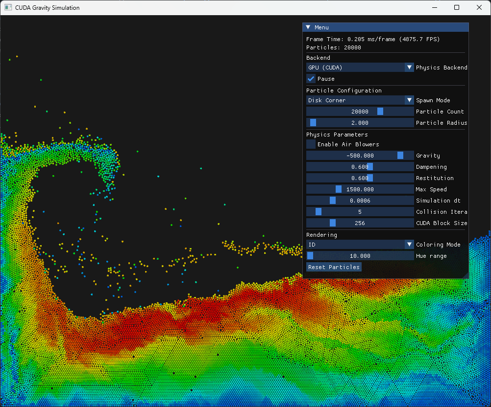

# Symulacja Grawitacji i Kolizji Cząsteczek w CUDA



## Budowanie (CMake)

**UWAGA**: Testowane tylko na Windowsie z Visual Studio 2022. Podejrzewam, że na Linuksie nie zadziała ponieważ podlinkowane biblioteki są zbudowane na Windowsie.

Wymagania:

- NVIDIA CUDA Toolkit (wspierana wersja zgodna z Twoją kartą)
- Visual Studio 2022 (C++ Desktop)

Kroki (PowerShell):

1. Configuracja projektu z CMake (należy dostosować wersję CUDA i architekturę GPU):

```
cmake -G "Visual Studio 17 2022" -A x64 -B build/vs/vs2022-release -T cuda=12.8 -DCMAKE_CUDA_ARCHITECTURES=75
```

2. Budowanie projektu:

```
cmake --build build/vs/vs2022-release --config Release
```

3. Lokalizacja programu:

```
./build/vs/vs2022-release/Release/cuda_gravbox.exe
```

Uwaga: jeśli zamierzasz korzystać z innego buildchaina niż Visual Studio 2022, to może być potrzebne zamiast flagi `-T cuda=12.8` użycie `-DCUDAToolkit_ROOT=...` aby wskazać kompilator CUDA.
